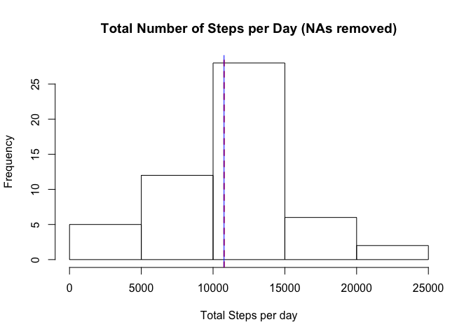

# Reproducible Research: Peer Assessment 1


## Loading and preprocessing the data

```r
library(dplyr)
```

```
## 
## Attaching package: 'dplyr'
## 
## The following objects are masked from 'package:stats':
## 
##     filter, lag
## 
## The following objects are masked from 'package:base':
## 
##     intersect, setdiff, setequal, union
```

```r
library(ggplot2)
#1
stepData <- read.csv("activity.csv", header = TRUE, stringsAsFactors = FALSE)
#2
# puts columns in correct class to allow easier handling
stepData$date <- as.Date(stepData$date)
stepData$steps <- as.numeric(stepData$steps)
```


## What is mean total number of steps taken per day?
For this step, I will use the base plot package to create a histogram of the total number of steps per day. I will discard NA values for this step.
The aggregate function is used here to calculate the total number of steps per day. This new dataframe is saved as "totalSteps" and contains one integer value per date. 


```r
totalSteps <- aggregate(stepData$steps ~ stepData$date, data = stepData, sum, na.rm = TRUE)
colnames(totalSteps) <- c("Date", "Steps")
meanSteps <- as.integer(mean(totalSteps$Steps, na.rm = TRUE))
medianSteps <- as.integer(median(totalSteps$Steps, na.rm = TRUE))
#1
hist (totalSteps$Steps, main = "Total Number of Steps per Day (NAs removed)", xlab = "Total Steps per day")
abline(v = meanSteps, col = "red", lty = 2, lwd = 2)
abline(v = medianSteps, col = "blue")
```

 

(#2)
A red abline is added at the mean of the values (10766). The blue a line is the median of the values (10765).

## What is the average daily activity pattern?
To see the average daily activity pattern, a time series plot must be created, with the 5 minute interval times as the x-axis and the average steps per interval across all days recorded as the y-axis. The aggregate function is used to get the mean per interval across all days.


```r
intervals <- aggregate(stepData$steps ~ stepData$interval, data = stepData, mean, na.rm = TRUE)
colnames(intervals) <- c("interval", "ave_steps")
#1
plot(intervals, type = "l")
```

 
 
To find which interval has the highest number of average steps, I use the which.max() function.
 

```r
#2
intervals[(which.max(intervals$ave_steps)), ]
```

```
##     interval ave_steps
## 104      835  206.1698
```

## Imputing missing values

```r
numNAs <- sum(is.na(stepData$steps))
```

(#1) - There are 2304 NA values in the dataset. 

(#2) - To handle the NAs, I will replace the NA value with the average of the five minute interval values across all days. To determine the average values of the different intervals, I took the "intervals" dataframe (created in the previous section) and merged it with the "stepData" dataframe on the interval column so that all datapoints are present in the "workingData" df.

To  replace the NAs, I created a for loop that replaced the NA in column 2 (steps) with the value in column 4 (Ave_Steps). See example - head(workingData) before replacing NAs (line 1)


```r
workingData <- merge(stepData, intervals, by = "interval")

head (workingData)
```

```
##   interval steps       date ave_steps
## 1        0    NA 2012-10-01  1.716981
## 2        0     0 2012-11-23  1.716981
## 3        0     0 2012-10-28  1.716981
## 4        0     0 2012-11-06  1.716981
## 5        0     0 2012-11-24  1.716981
## 6        0     0 2012-11-15  1.716981
```

See example - head(workingData) after replacing NA with value from col 4

```r
#3
for(i in 1:length(workingData$steps)){if(is.na(workingData[i,2])){workingData[i,2]<-workingData[i,4]}}
head(workingData)
```

```
##   interval    steps       date ave_steps
## 1        0 1.716981 2012-10-01  1.716981
## 2        0 0.000000 2012-11-23  1.716981
## 3        0 0.000000 2012-10-28  1.716981
## 4        0 0.000000 2012-11-06  1.716981
## 5        0 0.000000 2012-11-24  1.716981
## 6        0 0.000000 2012-11-15  1.716981
```

```r
# Instuctions say to make dataset equal to original, with NAs filled in, so I will delete ave_steps column 
# and reorder columns
workingData$ave_steps <- NULL
completeData <- arrange(workingData, date, interval)
completeData <-completeData[c("steps", "date", "interval")]
# for comparison
head(stepData)
```

```
##   steps       date interval
## 1    NA 2012-10-01        0
## 2    NA 2012-10-01        5
## 3    NA 2012-10-01       10
## 4    NA 2012-10-01       15
## 5    NA 2012-10-01       20
## 6    NA 2012-10-01       25
```

```r
head(completeData)
```

```
##       steps       date interval
## 1 1.7169811 2012-10-01        0
## 2 0.3396226 2012-10-01        5
## 3 0.1320755 2012-10-01       10
## 4 0.1509434 2012-10-01       15
## 5 0.0754717 2012-10-01       20
## 6 2.0943396 2012-10-01       25
```

(#4) Histogram creation

```r
totalStp <- aggregate(completeData$steps ~ completeData$date, data = completeData, sum)
colnames(totalStp) <- c("date", "steps")

meanStp <- as.integer(mean(totalStp$steps))
medianStp <- as.integer(median(totalStp$steps))

hist (totalStp$steps, main = "Total Number of Steps per Day (NAs filled out)", xlab = "Total Steps per day")
abline(v = meanStp, col = "red", lty = 2, lwd = 2)
abline(v = medianStp, col = "blue")
```

 

A red abline is added at the mean of the values (10766). The blue a line is the median of the values (10766). The mean for this plot (10766) vs. the mean for the first plot (10766) are the same. The median for this plot (10766) vs. the median for the first plot (10765) are very close. I'll look at the max frequency between the two plots next by creating two histogram objects and evaluating the max counts.


```r
hist1 <- hist(totalSteps$Steps, plot = FALSE)
hist2 <- hist(totalStp$steps, plot = FALSE)
maxH1 <- max(hist1$counts)
maxH2 <- max(hist2$counts)
diffHist <- abs(maxH2 - maxH1)
```
The max frequency for the first plot is 28 and the max frequency for the current plot is 36, a difference of 8. When dealing with over ten thousand values, this is not statistically significant.


## Are there differences in activity patterns between weekdays and weekends?

A factored dataset will be created to separate the weekdays and weekends. From there, a panal plot is required to show two time series plots with the 5 minute interval times as the x-axis and the average steps per interval across all days recorded as the y-axis for both the weekdays and weekends. I will start with the dataset that has all the NAs filled in (completeData).


```r
weekdayVector <- c("Monday", "Tuesday", "Wednesday", "Thursday", "Friday")
weekendVector <- c("Saturday", "Sunday")
# convert date column to day names
completeData$date <- weekdays(completeData$date)
# create factors
#1
completeData$date <- factor((completeData$date %in% weekdayVector), levels = c(TRUE, FALSE), labels = c("Weekday", "Weekend"))
```
To create a multipanel plot, I will use the base plot system. The data is filtered out to make manipulation easy.


```r
WD <- filter(completeData, date == "Weekday")
WE <- filter(completeData, date == "Weekend")
WDPlot <- aggregate(WD$steps ~ WD$interval, WD, mean)
WEPlot <- aggregate(WE$steps ~ WE$interval, WE, mean)
#2
par(mfrow = c(2, 1), pin = c(5,3), mar = c(4,4,2,2))
# multi-plot
with (completeData, {
      plot(WDPlot, type = "l", main = "Weekday Average Total Steps", xlab = "Intervals", ylab = "Ave. Steps", cex.axis = 0.6, cex.lab = 0.7, cex.main = 0.8)
  
      plot(WEPlot, type = "l", main = "Weekend Average Total Steps", xlab = "Intervals", ylab = "Ave. Steps", cex.axis = 0.6, cex.lab = 0.7, cex.main = 0.8)
})
```

 

From the plots, we can see the different behavior from the Weekdays and the Weekend.


```r
WDmax <- max(WDPlot$`WD$steps`)
WEmax <- max(WEPlot$`WE$steps`)

WDave <- mean(WDPlot$`WD$steps`)
WEave <- mean(WEPlot$`WE$steps`)
```

We can see that during the Weekdays, there is a large spike of activity in the 750-1000 interval,that reaches a maximum average steps of 230.3781971 - larger than the max step average during the Weekend (166.6391509).

During the Weekdays, the total average per interval is 35.6105812 and the Weekends it is 42.3664013, supporting a theory that more steps on average are taken on the Weekend.
